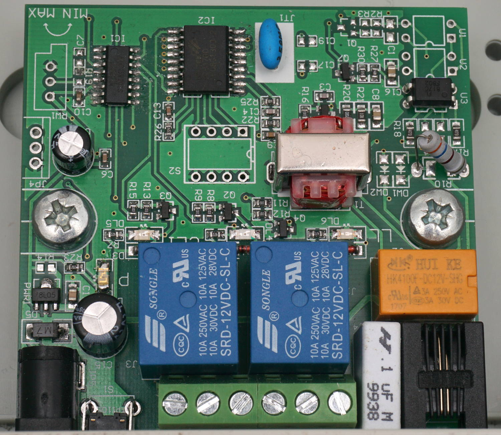

YC-KZ02DN (Telephone Remote Control) Schematic and Alternative Firmware
=======================================================================

The YC-KZ02DN is a cheap telephone remote control you can find on eBay and aliexpress. It is usually called something like 12v Telephone remote control. It is a pretty simple device that uses the POTS (Plain old telephone service) to control two relays. It essentially consists of:

 * A HT9170D for DTMF decoding
 * A STC15W202S, which is a cheap mcu with 8051 instruction set
 * Two relays to control external devices
 * One relay to pick/hang up the phone
 * An optocoupler for call detection
 * An audio transformer as part of the POTS interface
 * A tactile push button to reset the PIN

I reverse engineered the circuit. For details please look at the [schematic](schematic/phone_control.pdf). Interestingly there are some variants, that come without the HT9170D. These devices have some DIP switches mounted at S2 and will simply act on an incoming call. There has to be another variant, that comes with a potentiometer mounted.

The STC15W202S MCU has an integrated bootloader, which allows it to be reprogrammed via a serial interface. The needed pins can be accessed via the unpopulated pin header JP4.

Alternative Firmware
--------------------

I wrote a firmware replacement for this device. It has some additional features:
 * Restore the last state after power loss
 * Support longer PINs

The PIN and the state are saved into persistent memory.

The normal operation is like this:
1. Call
2. Wait until pickup, you'll hear a greeting tone
3. Enter PIN to authenticate
4. If the PIN is correct you'll hear a confirmation tone, otherwise, it will hang up
5. You can now configure the relays. Press
   * `1` to close relay 1
   * `2` to open relay 1
   * `3` to close relay 2
   * `4` to open relay 2
   * `*` to hang up
6. Hear confirmation beeps, repeat step 4.

In case of a timeout, the device will just hang up.

You can also change the PIN:
1. Call
2. Press button (before the device would pick up automatically)
3. Enter new PIN
4. You'll hear a confirmation tone and the device hangs up.

The very limited memory doesn't allow for an interactive voice menu. You can only play beep sounds.

The original firmware had a feature, which allowed to actuate the relays only for a configurable time, but I didn't implement this. You could easily implement it by yourself.

